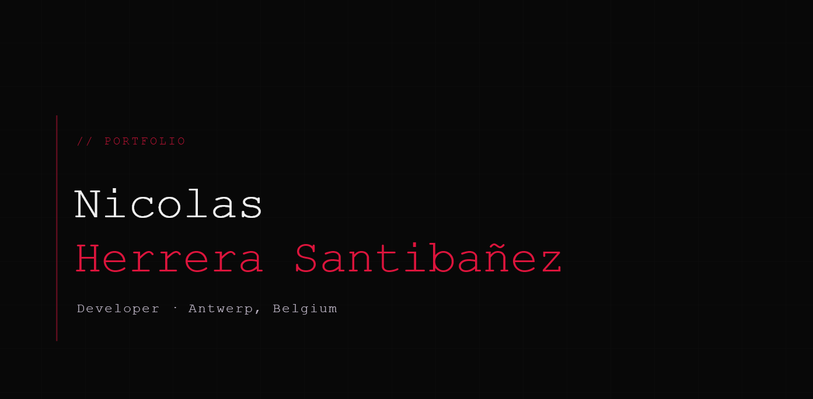

# nherrera.dev

Personal portfolio — **[nherrera.dev](https://nherrera.dev)**



## Stack

- **Frontend** — React 19 + Vite, React Router
- **Backend** — Vercel Serverless Functions (Node.js)
- **Database** — MongoDB Atlas
- **Media** — Cloudinary (image uploads)
- **Auth** — JWT (admin dashboard)
- **Hosting** — Vercel

## Features

- Blog / notes with Markdown support and cover images
- Project showcase with block-based content editor
- Admin dashboard — manage posts, projects, messages
- Visit tracking — total views, country, referrer source
- CV download counter
- Contact form
- SEO meta tags + Open Graph image

## Local development

```bash
npm install
vercel dev
```

Requires a `.env` file with:

```
MONGODB_URI=...
JWT_SECRET=...
```
